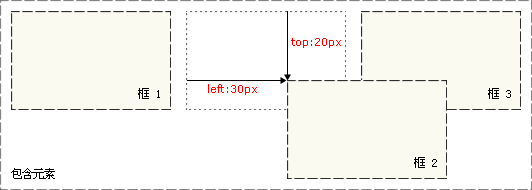
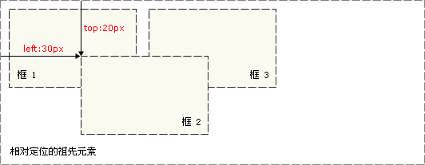

## CSS 定位

------

### CSS 定位 (Positioning)

- 一切皆为框
- CSS 定位机制：普通流、浮动和绝对定位。

```css
1. 普通流中的元素的位置由元素在 (X)HTML 中的位置决定。
2. 块级框从上到下一个接一个地排列，框之间的垂直距离是由框的垂直外边距计算出来。
3. 行内框在一行中水平布置。可以使用水平内边距、边框和外边距调整它们的间距;
// 垂直padding、border和margin不影响行内框的高度;
// 由一行形成的水平框称为行框（Line Box），行框的高度总是足以容纳它包含的所有行内框;
// 设置line-height可以增加这个框的高度。
```

### CSS position 属性

- static:元素框正常生成。块级元素生成一个矩形框，作为文档流的一部分，行内元素则会创建一个或多个行框，置于其父元素中。
- relative:元素框偏移某个距离。元素仍保持其未定位前的形状，它原本所占的空间仍保留。
- absolute:元素框从文档流完全删除，并相对于其包含块定位；元素原先在正常文档流中所占的空间会关闭，就好像元素原来不存在一样；元素定位后生成一个块级框，而不论原来它在正常流中生成何种类型的框。
- fixed:元素框的表现类似于将 position 设置为 absolute，不过其包含块是视窗本身。
- sticky:元素框的表现类似于将 position 设置为 relative；而当页面滚动超出目标区域时，元素框的表现类似于将 position 设置为 fixed，它会固定在目标位置。
- inherit:元素框从父元素继承 position 属性的值。
- initial:元素框将position设置为默认值。

### CSS 相对定位

- 如果对一个元素进行相对定位，它将出现在它所在的位置上。
- 可以通过设置垂直或水平位置，让这个元素“相对于”它的起点进行移动。



```css
#box_relative {
  position: relative;
  left: 30px;
  top: 20px;
}
```

### CSS 绝对定位

- 绝对定位使元素的位置与文档流无关，因此不占据空间。
- 相对定位实际上被看作普通流定位模型的一部分，因为元素的位置相对于它在普通流中的位置。



```css
#box_relative {
  position: absolute;
  left: 30px;
  top: 20px;
}
```

### Z-INDEX

- z-index 属性设置元素的堆叠顺序。
- 拥有更高堆叠顺序的元素总是会处于堆叠顺序较低的元素的前面。
- 仅能绝对定位模式absolute有效。

```css
img {
    position:absolute;
    left:0px;
    top:0px;
    z-index:-1;
}
```