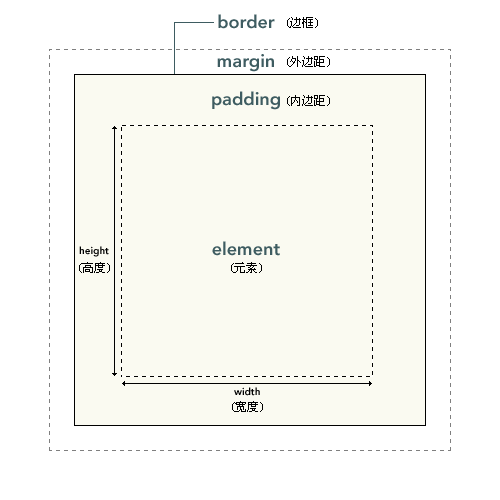
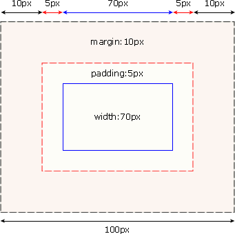
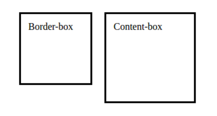
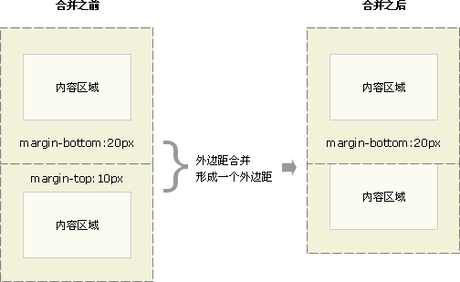
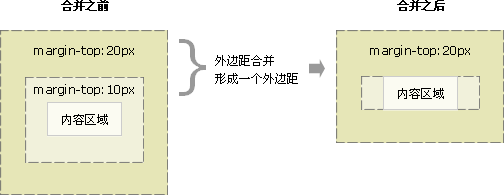
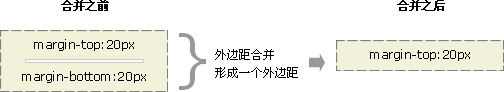
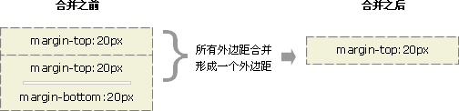
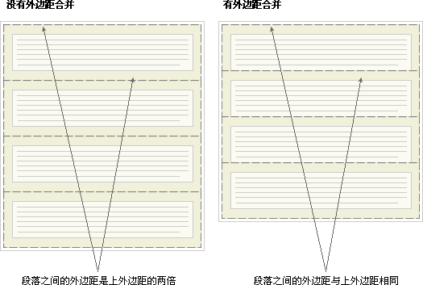

## CSS盒子模型

------

### CSS 框模型概述

​	css盒子模型又称框模型（Box Model），包含了元素内容（content）、内边距（padding）、边框（border）、外边距（margin）几个要素。如图：



```css
内边距、边框和外边距都是可选的，默认值是零;可以通过将元素的 margin 和 padding 设置为零来覆盖这些浏览器样式。
* {
  margin: 0;
  padding: 0;
}
```

### CSS 框模型概述

- width 和 height 指的是内容区域的宽度和高度
- 增加内边距、边框和外边距不会影响内容区域的尺寸，但是会增加元素框的总尺寸。
  

```css
#box {
  width: 70px;
  margin: 10px;
  padding: 5px;
}
```

### CSS 内边距

- 元素的内边距在边框和内容区之间.
- CSS padding 属性定义元素的内边距,不允许使用负值.

```css
h1 {padding: 10px;}
//各边均可以使用不同的单位或百分比值：
h1 {padding: 10px 0.25em 2ex 20%;}
//分开书写
h1 {
  padding-top: 10px;
  padding-right: 0.25em;
  padding-bottom: 2ex;
  padding-left: 20%;
  }
```

### CSS 边框

- 元素的边框 (border) 是围绕元素内容和内边距的一条或多条线
- CSS border 属性允许你规定元素边框的样式、宽度和颜色

#### 边框的样式

- 样式是边框最重要的一个方面，如果没有样式，将根本没有边框。
- border-style 属性定义了 10 个不同的非 inherit 样式，包括 none

```css
p.aside {border-style: solid dotted dashed double;}
//
p {border-style: solid solid solid none;}
p {border-style: solid; border-left-style: none;}
```

#### 边框的宽度

- 可以通过 border-width 属性为边框指定宽度
- 为边框指定宽度有两种方法：可以指定长度值，比如 2px 或 0.1em；或者使用 3 个关键字之一，它们分别是 thin 、medium（默认值） 和 thick。

```css
p {border-style: solid; border-width: 5px;}
p {border-style: solid; border-width: thick;}
p {border-style: solid; border-width: 15px 5px 15px 5px;}
//尽管边框的宽度是 50px，但是边框样式设置为 none, 边框根本不存在，
//就不可能有宽度，因此边框宽度自动设置为 0，而不论您原先定义的是什么。
p {border-style: none; border-width: 50px;}
```

##### 边框的颜色

- 使用一个简单的 border-color 属性，它一次可以接受最多 4 个颜色值。
- 可以使用任何类型的颜色值，例如可以是命名颜色，也可以是十六进制和 RGB 值。

```css
p {
  border-style: solid;
  border-color: blue rgb(25%,35%,45%) #909090 red;
}
```

#### 盒子尺寸 box-sizing

box-sizing 属性让我们可以控制盒子模型尺寸的计算方式，它有两个可选的值，分别是 content-box 和 border-box.

| box-sizing属性 | 计算原理                                    |
| ------------ | --------------------------------------- |
| border-box   | 实际宽高 = 指定宽高 + margin                    |
| content-box  | 实际宽高 = 指定宽高 + padding + border + margin |
| inherit      | 实际宽高 = 父元素宽高                            |

```css
.box-1{
     box-sizing: border-box;
     width: 120px;
     height: 120px;
     border: 3px solid #000;
     padding: 12px;
 }

 .box-2{
     box-sizing: content-box;
     width: 120px;
     height: 120px;
     border: 3px solid #000;
     padding: 12px;
 }
```



### CSS 外边距

- 围绕在元素边框的空白区域是外边距。
- 设置外边距会在元素外创建额外的“空白”。
- margin属性可以接受任何长度单位、百分数值甚至负值。

```css
h1 {
  margin : 10px 0px 15px 5px;
}
//百分数是相对于父元素的 width 计算的。上例p元素设置的外边距是其父元素的width的10%。
p {
  margin : 10%;
}
//
h2 {
  margin-top: 20px;
  margin-right: 30px;
  margin-bottom: 30px;
  margin-left: 20px;
}
```


### CSS 外边距合并（叠加）

- 外边距合并指的是，当两个垂直外边距相遇时，它们将形成一个外边距。
- 合并后的外边距的高度等于两个发生合并的外边距的高度中的较大者。

#### CSS 外边距合并 -- 01

两个上下方向相邻的元素框垂直相遇时，外边距会合并，合并后的外边距的高度等于两个发生合并的外边距中较高的那个边距值


#### CSS 外边距合并 -- 02

当一个元素包含在另一个元素中时（假设没有内边距或边框把外边距分隔开），它们的上和/或下外边距也会发生合并。


#### CSS 外边距合并 -- 03

- 假设有一个空元素，它有外边距，但是没有边框或填充。
- 在这种情况下，上外边距与下外边距就碰到了一起，它们会发生合并。
  

#### CSS 外边距合并 -- 04

- 如果这个外边距遇到另一个元素的外边距，它还会发生合并。
  

```html
* 第一个段落上面的空间等于段落的上外边距。
* 如果没有外边距合并，后续所有段落之间的外边距都将是相邻上外边距和下外边距的和。
* 如果发生外边距合并，段落之间的上外边距和下外边距就合并在一起。
```




