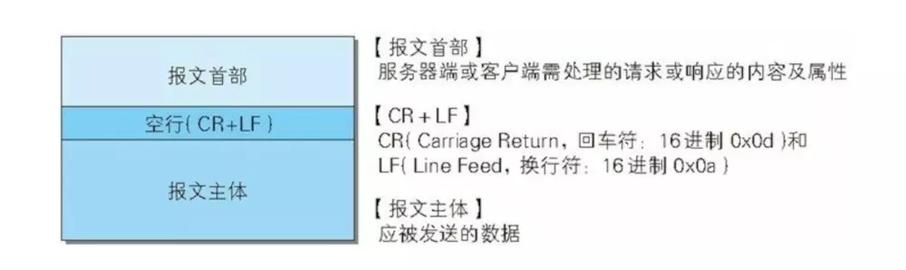
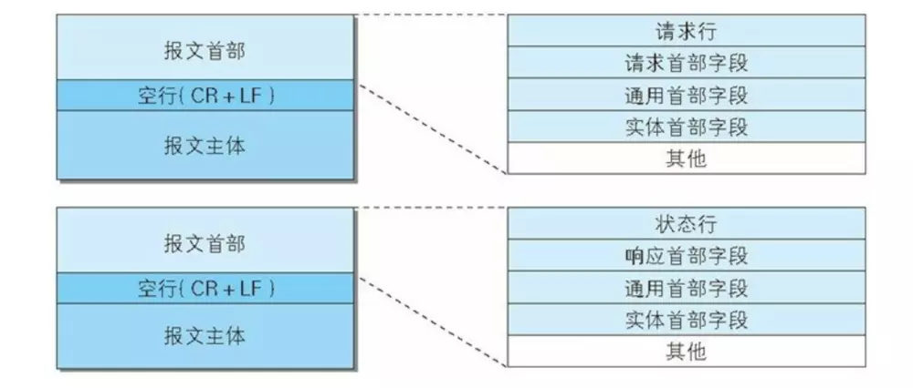
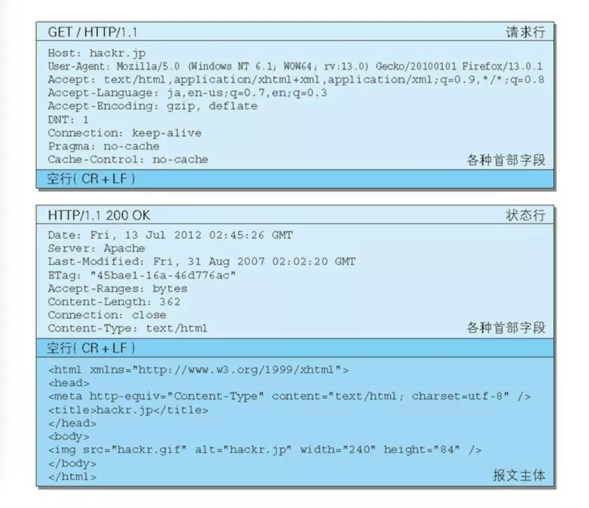
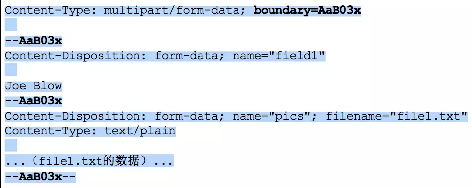
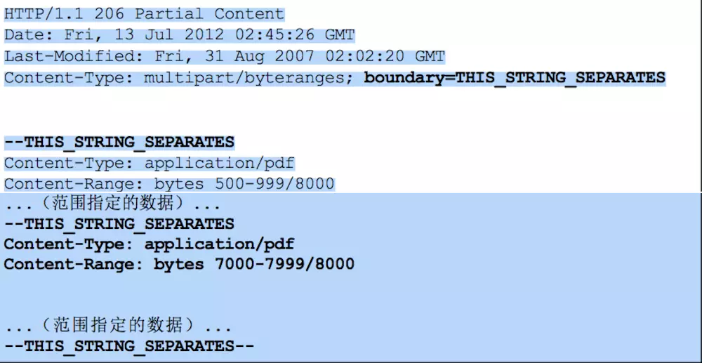

# HTTP报文内的HTTP信息

`HTTP`通信过程包括从客户端发往服务器及从服务端返回客户端的响应

## 1.  HTTP报文

用于`HTTP`协议交互的信息被称为`HTTP`报文。请求端的`HTTP`报文叫做请求报文，响应端的叫做响应报文。`HTTP`报文本身是由多行数据结构构成的字符串文本，用`CR+LF`作换行符

`HTTP`报文大致可以分为报文首部和报文主体两块，两者由最早出现的空行分隔开，**一般并不一定有报文主体**

报文结构

------

## 2. 请求报文及响应报文的结构

请求报文和响应报文结构

请求报文及响应报文 示例
报文结构

-  **请求行：**包含用语请求的方法，请求`URI`和`HTTP`版本
-  **状态行：**包含表明响应结果的状态码，原因短语和`HTTP`版本
-  **首部字段：**包含表示请求和响应的各种条件和属性的各类首部，一般有4种，通用首部，请求首部，响应首部，实体首部
-  **其他：**可能包含`HTTP`的`RFC`里未定义的首部，`cookie`等

------

## 3.  编码提升传输速率

`HTTP`在传输数据时可以按照数据原样直接传输，也可以在传输过程中通过编码提升传输速率。但，编码的过程会消耗`CPU`等资源

### 3.1 报文主体和实体的差异

- **报文Message**

   `HTTP`通信中的基本单位，由8位组字节流`octet sequeence`组成，通过`HTTP`通信传输

- **实体Enity**

   作为请求或响应的有效载荷数据被传输，内容由实体首部和实体组成

`HTTP`报文的主体用语传输请求或响应的实体主体

一般，报文主体等于实体主体，只有当传输中进行编码操作时，实体主体的内容发生变化，才导致它和报文主体产生差异

------

- **压缩传输的内容编码**

1. gzip(GNU zip)
2. compress(Unix系统的标准压缩)
3. defalte(zlib)
4. identity(不进行编码)

------

## 4. 发送多种数据的多部分对象集合

邮件中通常可以添加附件，邮件采用的是`MIME(Mulitipurpose Internet Mail Extensions)多用途因特网邮件扩展`，允许邮件处理文本，图片，视频等多个不同类型的数据

在`HTTP`协议中，也可以采用多部分对象集合，发送一份报文主体内可以含有多类型实体，通常用于图片和文本文件上传

-  **multipart/form-data**

   在`Web`表单文件上传时使用

-  **multipart／byteranges**

   状态码206响应报文包含了多个范围的内容时使用

- `multipart／form-data`

  

  

  
multipart／form-data

- `multipart／byteranges`

  

  

  
multipart／byteranges

使用`boundary`字符串来划分多部分对象集合指名的各类实体类

在`boundary`字符串指定的各个实体的起始之前加`--`，在多部分对象集合对应的字符串的最后插入`--`作为结束

多部分对象集合的每个部分类型中，都可以含有首部字段，也可以在某个部分中嵌套使用多部分对象集合