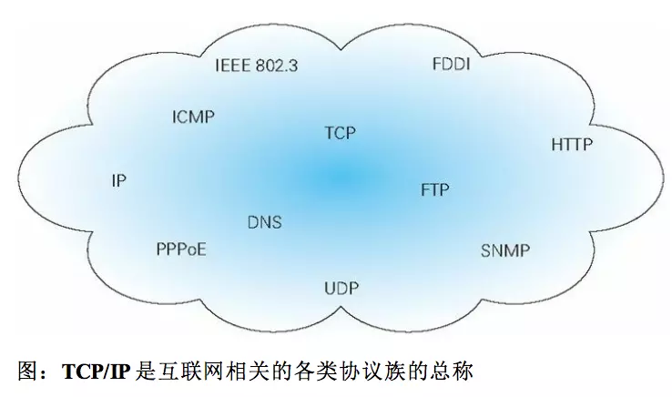

## TCP/IP 基础

-----

通常使用的网络（包括互联网）是在 `TCP/IP` 协议族的基础上运作的。而 `HTTP` 属于它的一个子集。

计算机与网络设备要相互通信，双方就必须基于相同的方法。例如，如何探测到通信目标、由哪一边先发起通信、使用哪种语言进行通信、怎样结束通信等规则都需要事先确定。

不同的硬件、操作系统之间的通信，所有的一切都需要一种规则，这种规则被称为 **协议protocol**， **而TCP/IP是互联网相关协议的各类协议族的总称**。

**作用：**

-  **IP协议：**指定数据发送目的地的IP地址以及通过路由器转发数据
-  **TCP协议：**通过数据发送者和接收者相互回应对方发来的确认信号，可靠地传输数据

协议中存在各式各样的内容。电缆的规格到`IP`地址的选定方法，寻找异地用户的方法、双方建立通信的顺序，以及Web页面显示需要的步骤，等等之类的

> 协议，个人理解，就是网络间通信的`江湖规矩`，行走江湖，出来混，就得遵守江湖规矩

### 1.1 TCP/IP分层

`TCP/IP`分4层：`应用层`,`传输层`,`网络层`,数据链路层

**分层的好处：**

1. 修改协议时，只需把需要变动的层替换就可以，改动比较自由。如整个协议不分层，只有一个整体，即使有一个改变地方需要改变设计，就得把所有不分整体替换。
2. 层次化之后，设计也变得相对简单。处于应用层上的应用考虑分派给自己的任务，而不必清楚对方在哪个地方，对方的传输路线是怎样的、是否能确保传输送达。

------

- **应用层：**决定向用户提供应用服务时通信的活动。

  `TCP/IP`协议族内预存了各类通用的应用服务。例如，`FTP(File Transfer Protocl)`，文件传输协议；`DNS(Domain Name System)`域名系统。 **HTTP协议**也在应用层。

- **传输层：**为上一层的应用层，提供处于网络连接中的两台计算机之间的数据传输。

  在传输层，有两个性质不同的协议：`TCP(Transmission Control Protocol)`传输控制协议协议，`UDP(User Data Protocl)`用户数据报协议。

- **网络层：**处理在网络上流动的数据包。

   **数据包**是网络传输的最小的数据单位。

  该层规定了通过怎样的路径到达对方计算机，并把数据包传送给对方。与对方计算机之间的通过多台计算机或网络设备进行传输时，网络层所起的作用的就是在众多的选项内选择一条传输路线。

- **链路层：**处理连接网络的硬件部分。

  包括控制操作系统、硬件的设备驱动、`NIC(Network Interface Card)`网卡，光纤等物理硬件部分。硬件上的范畴均在链路层的作用范围之内。

### 1.2 TCP/IP通信传输

TCP/IP通信传输流

利用`TCP/IP`协议族进行网络通信时，通过分层的顺序与对方进行通信，发送端从应用层往下走，接受端则向应用层，向上层走。

------

**HTTP举例说明：**

HTTP 通信举例

1. 作为发送端的客户端在应用层，遵循`HTTP`协议，发出一个显示某个`Web`页面的`HTTP`请求
2. 为了传输方便，在传输层`TCP`协议下，把从应用层处，收到的数据，也就是`HTTP`请求报文，进行分割，并在各个报文打上标记序号以及端口号后，转发给网络层
3. 在网络层，`IP`协议，增加作为通信目的地的`MAC`地址后，转发给链路层。到了此时，发往通信的请求就准备齐全
4. 接收端的服务器在链路层接收到数据，按序往上层发送，一直到应用层

当传输到应用层，才能算真正接收到由客户端发送过来的`HTTP`请求。

发送端在层与层之间传输数据时，每经过一层，必定会被打上一个该层所属的首部信息。反之，接收端在层与层传输数据时，每经过一层会把对应的首部消去。

过程之中，把数据信息包装起来的做法称为`封装`。

