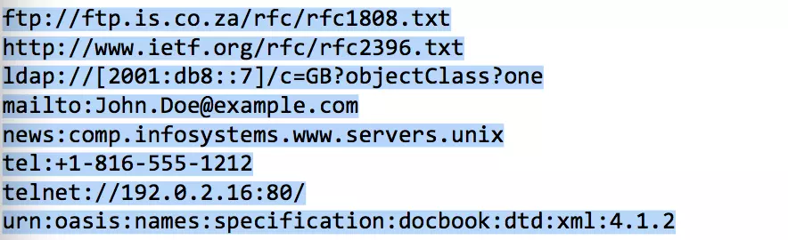
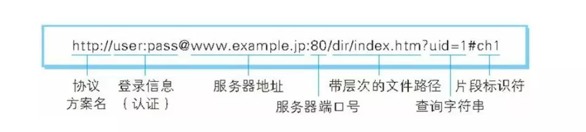

## URI 和 URL

**作用：**

-  **URI:**用字符串表示某一个互联网资源
-  **URL:**统一资源定位符，访问`Web`页面时，需要的网页地址。表示资源所在地点，所处的位置

`URL`是`URI`的子集

------

### 1.  URI统一资源标识符

`URI`是`Uniform Resource Identifier`

- **Uniform：**

   规定统一的格式可以方便处理多种不同类型的资源，不用再根据上下文环境来识别资源指定的访问方式。加入新的协议方案也更容易，例如`http:`或`ftp:`

- **Resource：**

   资源，指的是可标示的任何东西。除了文档文件，图像，或服务（如天气预报）等能够区别于其他类型的，全都可以作为资源。资源不仅可以是单一的，也可以是多数的集合体

- **Identifier：**

   可标示的对象。也称为标识符

`URI`就是由某个协议方案表示的资源的定位标识符，协议方案是指访问资源使用的协议类型名称

采用`HTTP`协议时，协议方案就是`http`，还有`ftp,mailto,telnet,file`等。标准的协议方案有30多种

URI 举例

------

### 2. URL格式

表示指定的`URI`，要使用涵盖全部信息的`绝对URI`，`绝对URL`，`相对URL`

**相对URI:**是指从浏览器中基本`URI`处指定的`URL`，例如`image/logo.png`

绝对URI格式

- **协议方案名：**

   使用`http:`或`https:`等协议方案名称获取访问资源时要指定协议类型，不区分字母大小写，最后附一个`:`

- **登录信息：**可选项

   指定用户名和密码作为从服务器端获取资源时，必要的登录信息，也就是身份认证，可选项

- **服务器地址：**

   使用绝对`URI`必须指定待访问的服务器地址。地址可以是`IP`地址，也可以是`DNS`可以解析的域名

- **服务器端口号：**可选项

   指定服务器连接的网络端口号。可选项，省略使用默认端口号

- **带层次的文件路径：**

   指定服务器上的文件路径来定位特指的资源

- **查询字符串：**可选项

   针对已指定的文件路径内的资源，可以使用查询字段传入任意参数，可选项

- **片段标识符：**可选项

   使用片段标识符通常可以标记出已获取资源中的子资源，文档内的某个位置