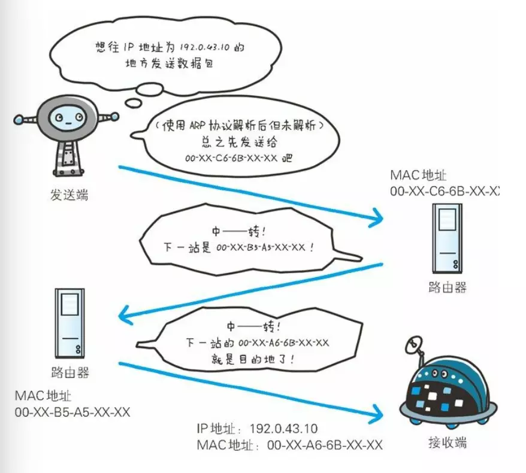
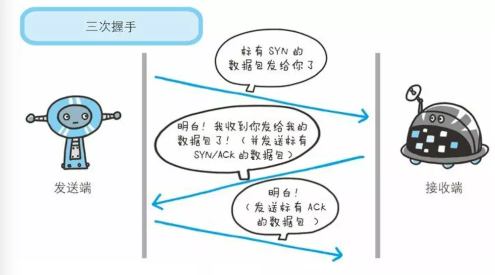
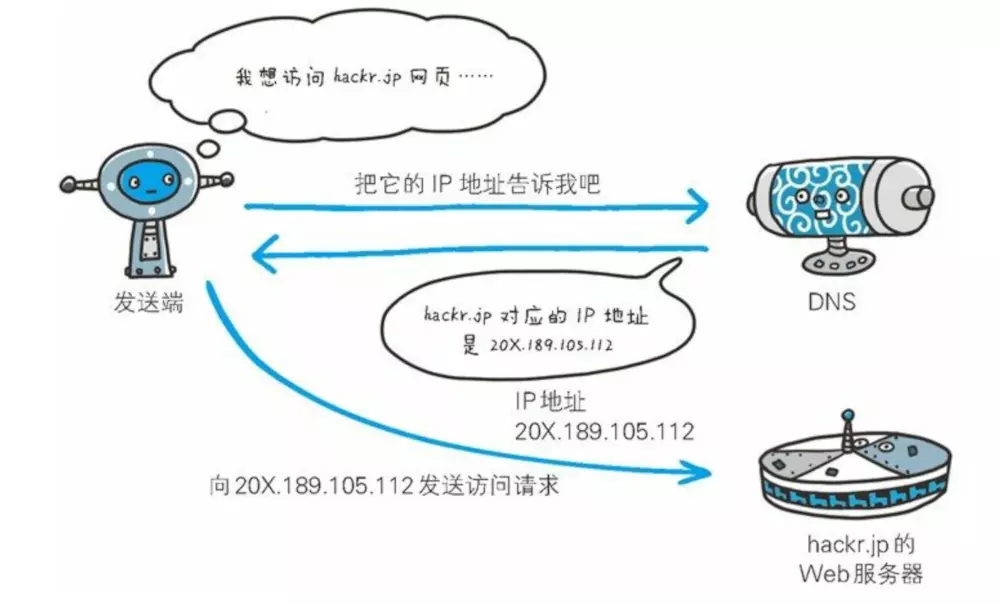
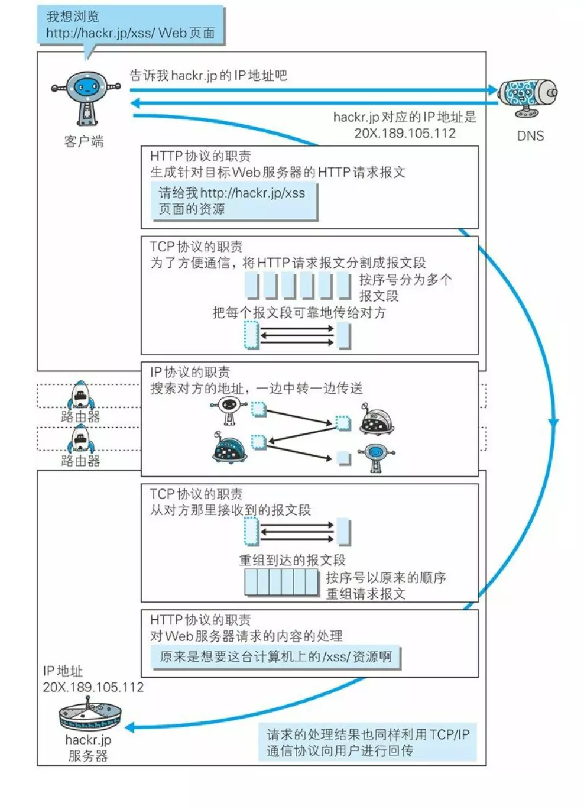

## 与HTTP关系密切的协议

### 1.  负责传输的IP协议

按层次分，`IP(Internet Protocol)`网际协议位于网络层。 **几乎所有使用网络的系统都会用到IP协议**

`IP`协议的作用是把各种数据包传给对方。而要保证确实传到对方那里，有两个重要的条件`IP 地址`和`MAC 地址(Media Access Control Address)`

-  `IP地址`指明路节点被分配到的地址
-  `MAC地址`是指网卡所属的固定地址

`IP`地址可以和`MAC`地址进行配对，但 **IP地址可变换，MAC地址基本上是固定的，唯一的，不会改变**

------

- 使用`ARP`协议凭借`MAC`地址进行通信

`IP`间的通信依赖`MAC`地址

一般，通信的双方都不在在同一局域网`LAN`内，通常是经过多台计算机和网络设备中转才能连接到对方。在进行中转时，会利用下一站中转设备的`MAC`地址搜索下一个中转目标

搜索中转目标需要`ARP(Address Resolution Rrotocol)`协议，`ARP`是一种用以解析地址的协议，根据通信方的`IP`地址就可以反查出对应的`MAC`地址

IP ARP MAC 工作流程

**无论哪台计算机、哪台网络设备，在通信过程中，它们都无法全面掌握互联网中的细节**

在到达通信目标前的中转过程中，涉及通信的计算机和路由器等网络设备只能获悉很粗略的传输路线，这种机制成为`路由选择(routing)`

类似送快递的整个过程，寄快递的人只需要将自己的包裹交给承运人，就可以查询到自己的包裹的状态，位置信息。而接管包裹的快递公司的集散中心检查包裹的送达地址，明确下一个送往集散中心，这个目标集散中心再进行判断包裹是否达到

整个过程，每个集散中心并不清楚知道包裹在上个环节或下个环节的具体细节

------

### 2.  确保可靠的TCP协议

`TCP`位于传输层，提供可靠的字节流服务

-  **字节流服务：**将大块数据分割成以`报文段(Byte Stream Service)`为单位的数据包进行管理

可靠，指的就是将数据准确可靠地传给对方

**概括：**`TCP`协议为了更容易传送大数据才把数据分割，而且`TCP`协议能够确认数据最终是否送达对方

------

- **三次握手**

用`TCP`协议将数据包送出去之后，`TCP`一定会向对方确认是否成功送达

握手过程中使用了`TCP`的标志`flag`——`SYN(synchronzie)`和`ACK(acknowledgement)`

3次握手

发送端首先发送一个带`SYN`标志的数据包给对方。接收端收到以后，回传一个带有`ACK`标志的数据包，代表握手结束

握手过程中，某个阶段莫名中断，`TCP`协议会再次以相同的顺序发送相同的数据包

然而`3次握手`也并不一定能确保数据100%准确送到

------

### 3.  负责域名解析的DNS服务

`DNS(Domain Name System)`服务和`HTTP`协议一样位于应用层的协议， **提供域名到IP地址之间的解析服务**

计算机既可以被赋予`IP`地址，也可以被赋予`主机名`和`域名`，例如`www.baidu.com`

域名相比较起`IP`地址，更利于网站的推广

但对于计算机而言，理解域名比`IP`地址要困难的多，计算机更擅长处理一长串数字

DNS协议

**DNS协议作用：**通过域名来查找`IP`地址，或逆向从`IP`地址反查域名的服务

------

## 各种协议与HTTP协议的关系

各种协议与HTTP协议的关系
