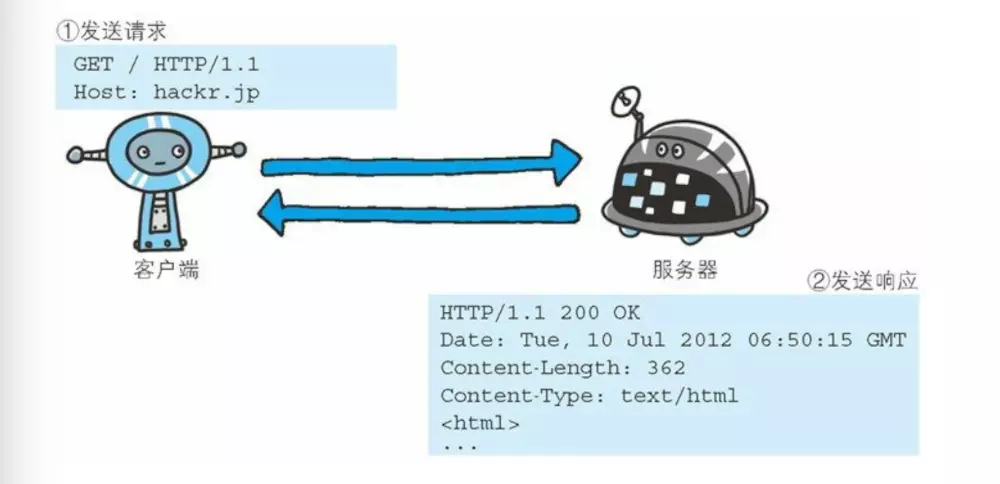
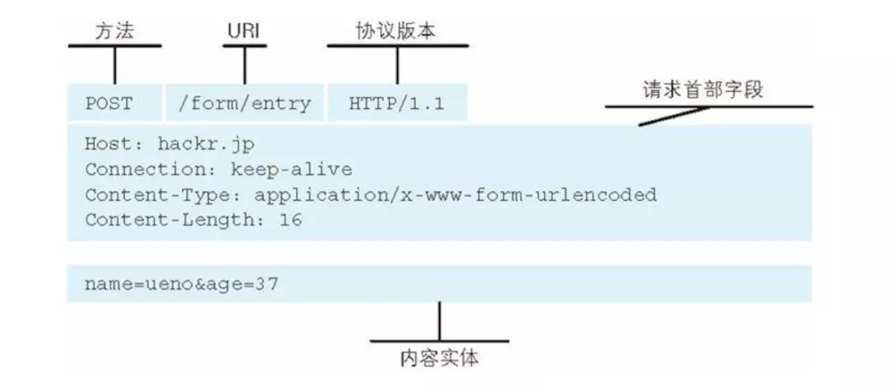
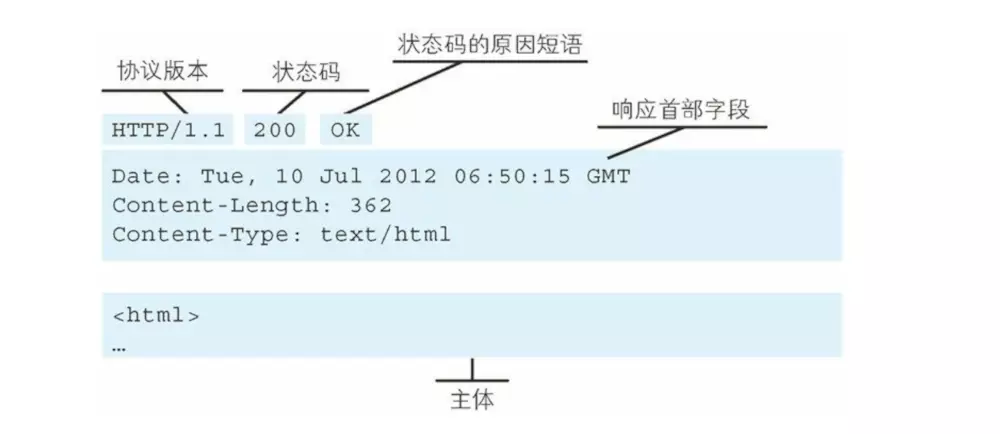
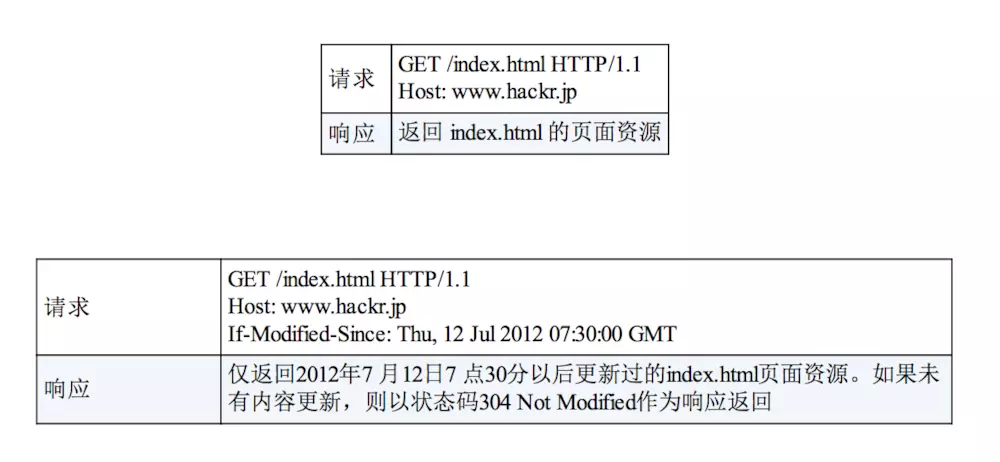
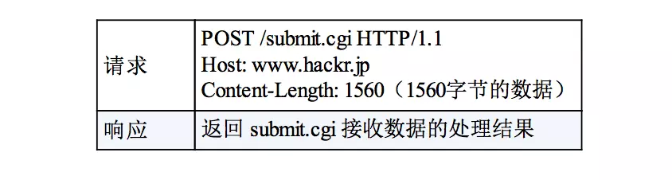
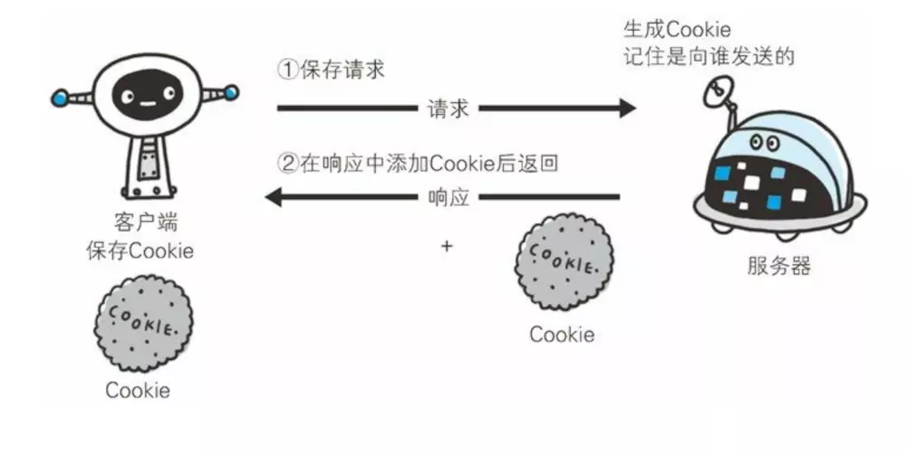
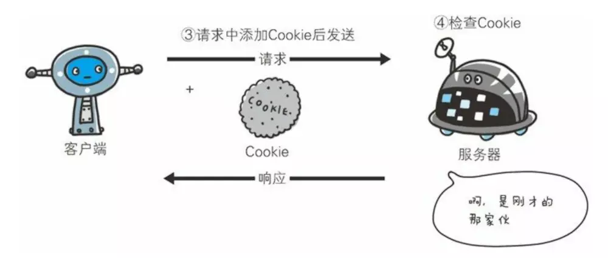
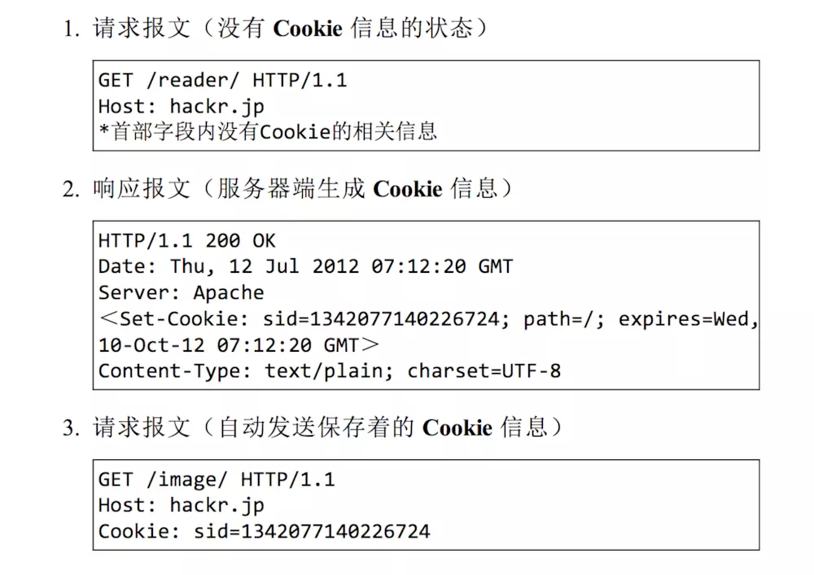

# 简单的HTTP协议

主要是对`HTTP`协议结构讲解，主要使用`HTTP/1.1`版本

-  **HTTP协议用于客户端和服务端之间的通信**

   `HTTP`协议和`TCP/IP`协议族内的其他众多的协议相同，用于客户端和服务器之间的通信


   请求访问文本或图像等资源的一端称为客户端，而提供资源的响应的一端称为服务器端


   使用`HTTP`能够明确区分哪一端是`客户端`，哪一端是`服务端` 

------

## 1.  通过请求和响应的交换达成通信

`HTTP`协议规定，请求从客户端发出，最后服务器端响应该请求并返回。也就是说，肯定是先从客户端开始建立通信的，服务器端在没有接受到请求之前不会响应

**具体示例：**




<p style="text-align:center">GET请求示例</p>

**请求头报文中内容：**

```
GET / index.htm HTTP/1.1
Host: hackr.jp
```

**含义：**请求访问某台`HTTP`服务器上的`/index.htm`页面资源

起始行开头的`GET`表示请求访问服务器的类型，称为`方法method`。随后的字符串`/index.htm`指明了请求访问的资源对象，也叫做`请求URI，request-URI`。最后的`HTTP/1.1`，就是`HTTP`的版本号，用来提示客户端使用的`HTTP`协议功能

------

**请求报文是由请求方法、请求`URL`、协议版本、可选的请求首部字段和内容实体构成的**




<p style="text-align:center">请求报文</p>

用于`HTTP`协议交互的信息被称为`HTTP报文`




<p style="text-align:center">响应报文</p>

`200`表示请求的处理结果的`状态码status code`，`OK`是`原因短语reason-phrase`

下一行显示了创建响应的日期时间，是`首部字段header first`内的一个属性

接着，空行；之后，便是资源的`实体entity body`

------

## 2. HTTP是不保存状态的协议

**HTTP协议自身不具备保存之前发送过的请求或响应的功能**

`HTTP`是一种不保存状态，`无状态stateless`协议，也就是`HTTP`这个级别，协议对于发送过的请求或响应都不做持久化处理

为了实现期望的保持状态功能，引入了`cookie`

使用`HTTP`协议时，每当有新的请求时，就会有对应的新响应产生。协议本身并不保留之前一切的请求或响应报文的信息

**HTTP协议使用URI定位互联网上的资源**

------

## 3.  HTTP方法

- GET:

  获取资源

  

  

  <p style="text-align:center">GET 请求</p>

`GET`方法用于请求访问已被`URI`识别的资源，指定的资源经服务器端解析后返回响应内容

 如果请求的资源是文本，就保持原样返回；如果是像`CGI(Common Gateway Interface)通用网关接口`那样的程序，则返回执行后的结果




<p style="text-align:center">GET 请求响应</p>

------

- POST：

  传输实体主体

  

  

  <p style="text-align:center">POST 请求</p>

`PSOT`方法用来传输实体的主体
 虽然用`GET`方法也可以传输实体的，但一般不用`GET`方法进行传输， **POST主要目的不是获取响应的主体内容**




<p style="text-align:center">PUT 请求响应</p>

------

-  **PUT:**用于传输文件，就像`FTP`协议的文件上传一样，要求在请求报文的主体中包含文件内容，然后保存到请求`URI`指定的位置，但由于`HTTP/1.1`的`PUT`方法自身不带验证机制，一般不采用
-  **HEAD:**和`GET`方法一样，只是返回报文主体部分，用于确认`URI`的有效性及资源更新的日期时间等
-  **DELETE:**删除文件，一般也不用
-  **OPTIONS:**询问支持的方法，用来查询针对请求`URI`指定的资源支持的方法

------

## 4.  使用Cookie的状态管理

由于`HTTP`是无状态协议，不会对之前发生过的请求和响应的状态进行管理

当要实现类似保存的登录信息这样的需求时，引入了`cookie`

`Cookie`会根据从服务端发送的响应内的一个叫做`Set-Cookie`的首部字段信息，通知客户端保存`Cookie`。当下次客户端再往该服务器发送请求时，客户端会自动在请求报文中加入`Cookie`值，然后发送出去

服务器端发现客户端发送过来的`Cookie`后，会主动检查是从哪一个客户端发来的连接请求，然后对比服务器上的记录，最后得到之前的状态信息

- **没有Cookie消息状态时，第1次请求**
  

  

  

  <p style="text-align:center">没有Cookie消息状态时</p>

  

- **存入Cookie信息，第2次请求**
  

  

  

  <p style="text-align:center">存入Cookie信息，第2次请求</p>

  

- **HTTP请求报文或响应报文**
  

  

  

  <p style="text-align:center">HTTP请求报文或响应报文</p>

