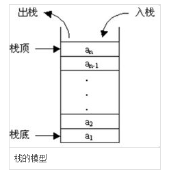
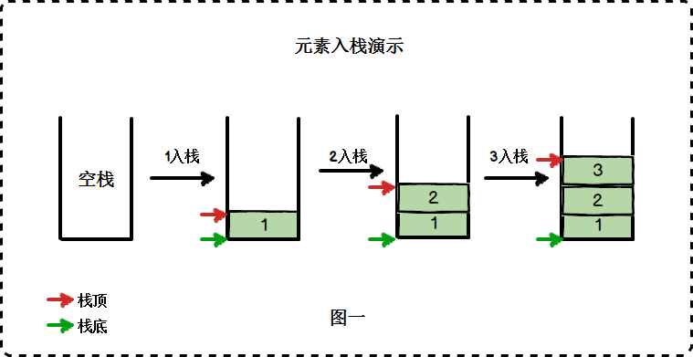
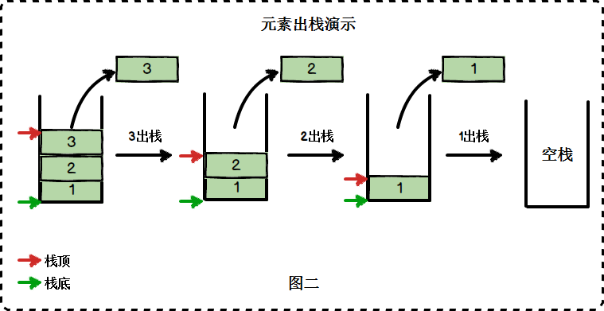
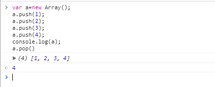
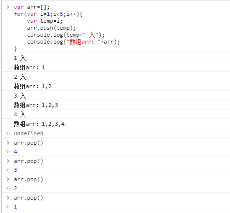
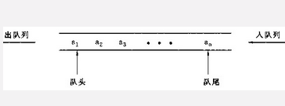
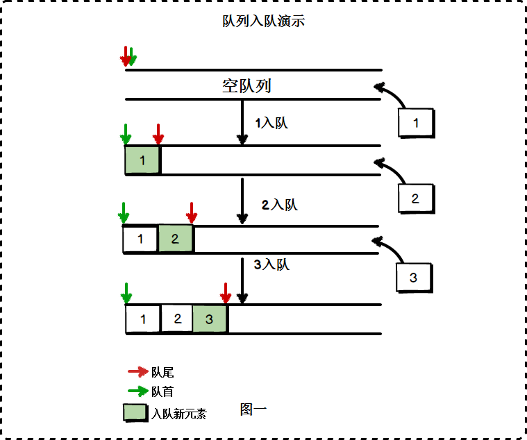
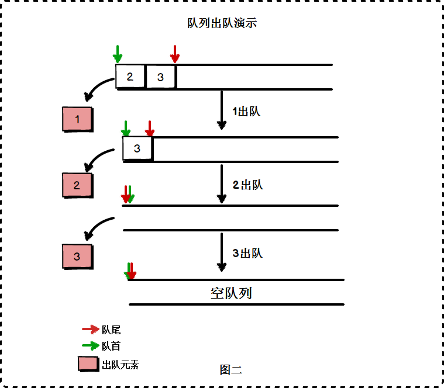
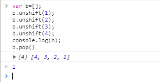
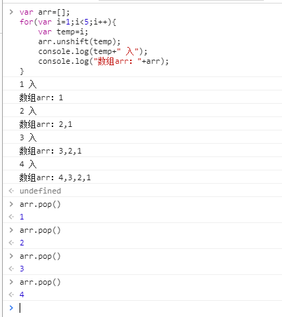

## JS数组栈和队列操作

------

### 栈（堆栈）

​		栈是一种后进先出的数据结构，也就是说最新添加的项最早被移出；它是一种运算受限的线性表，只能在表头进行插入和删除操作。
　　栈有栈底和栈顶。
　　向一个栈插入新元素叫入栈（进栈），就是把新元素放入到栈顶的上面，成为新的栈顶；
　　从一个栈删除元素叫出栈，就是把栈顶的元素删除掉，相邻的成为新栈顶；
　　也就是说栈里面的元素的插入和删除操作，只在栈顶进行；
　　打个比方：一队人马走入了一条胡同，只有一个入口，无出口，想要出去就只能把队尾变成队首开始出去；

* 先进后出

* 入栈pop()

  

* 出栈push()

  

  > 后进先出，最后插入的数，先取出！
  >
  > 先：
  >
  > 
  >
  > 再：
  >
  > 

### 队列

　	队列是一种先进先出的数据结构。 队列在列表的末端增加项，在首端移除项。
　　它允许在表的首端（队列头）进行删除操作，在表的末端（队列尾）进行插入操作；
　　相反的来说，可以在末端删除项，在首端插入项。

*  先进先出
*  出队pop()
* 入队push()
* 出队shift()
* 入队unshift()

JS为数组提供了方法可以实现队列功能， 入队unshift()、 出队pop()；

> 
>
> 

#### 总结

​		push()方法，它能在数组首端添加任意个项并返回新数组的长度。

　　pop()方法，删除并返回数组的最后一个元素。

　　unshift()方法，它能在数组首端添加任意个项并返回新数组的长度。

　　shift()方法，删除并返回数组的第一个元素。

*************

需要注意的一点是，按照先进先出的队列规则让第一个元素出队时，可使用shift()方法来完成。
出队区别使用 shift() 和 pop() 

*************

